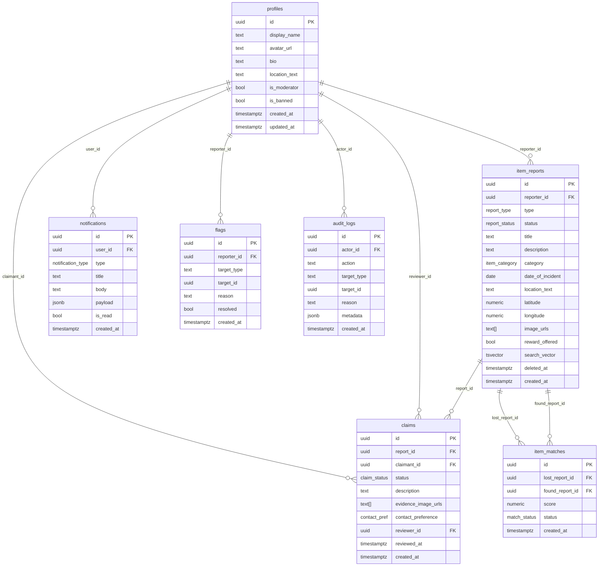

# FindBack — Design Specification
**Version:** 1.1  
**Phase:** 1 — Blueprint  
**Status:** Decisions Locked

**Locked decisions (2026-10-09):**
| # | Decision | Choice |
|---|---|---|
| Q1 | Color theme | Blue primary (`#1565C0`), white background, amber accent (`#FFB300`). Light mode only for MVP. |
| Q2 | Location strategy | Free-text only — no GPS, no API key required. `latitude`/`longitude` columns kept in schema but unused until a future map phase. |
| Q3 | Evidence image access | Auth header download via `supabase.storage.from('claim-evidence').download()` — no signed URLs. |
| Q4 | App name / bundle ID | Display name: `FindBack` · Bundle ID: `com.findback.app` |
| Q5 | Supabase project | Existing project — user provides URL + anon key via `.env` |
| Q6 | Match algorithm | Weights and threshold locked as specified (category 40%, text 40%, date 10%, location 10%; threshold 0.45) |
| Q7 | Claim approval model | Reporter-first — reporter approves/rejects; disputes escalate to moderator |

---

## 1. Architecture Overview

FindBack uses a **feature-first clean architecture** with three layers per feature:

```
Presentation  →  Domain (Riverpod Providers + Models)  →  Data (Repositories + Supabase)
```

The Flutter client never touches the database directly. Every read goes through a Repository, every write is either a Supabase RLS-protected client call or routed through a Supabase Edge Function for sensitive transitions.

```
┌─────────────────────────────────────────────┐
│                Flutter App                  │
│  ┌──────────┐  ┌──────────┐  ┌──────────┐  │
│  │  Auth    │  │ Reports  │  │ Claims   │  │
│  │ Feature  │  │ Feature  │  │ Feature  │  │
│  └────┬─────┘  └────┬─────┘  └────┬─────┘  │
│       │              │              │        │
│  ┌────▼──────────────▼──────────────▼─────┐ │
│  │         Riverpod Provider Layer        │ │
│  └────────────────────┬───────────────────┘ │
│  ┌─────────────────────▼──────────────────┐ │
│  │           Repository Layer             │ │
│  └─────────────────────┬──────────────────┘ │
└────────────────────────┼────────────────────┘
                         │ supabase_flutter SDK
              ┌──────────▼──────────┐
              │   Supabase Platform  │
              │  ┌───────────────┐  │
              │  │  PostgreSQL   │  │
              │  │  + RLS        │  │
              │  └───────────────┘  │
              │  ┌───────────────┐  │
              │  │  Auth (GoTrue)│  │
              │  └───────────────┘  │
              │  ┌───────────────┐  │
              │  │  Storage      │  │
              │  └───────────────┘  │
              │  ┌───────────────┐  │
              │  │ Edge Functions│  │
              │  └───────────────┘  │
              └─────────────────────┘
```

---

## 2. Flutter Project Structure

```
lib/
├── main.dart                         # App entry point, ProviderScope
├── app.dart                          # MaterialApp.router + GoRouter setup
├── core/
│   ├── constants/
│   │   ├── app_constants.dart        # Bucket names, max sizes, enums
│   │   └── supabase_constants.dart   # Table names, function names
│   ├── errors/
│   │   ├── app_exception.dart        # Typed exception hierarchy
│   │   └── failure.dart              # Failure sealed class
│   ├── extensions/
│   │   └── datetime_extensions.dart
│   ├── services/
│   │   ├── supabase_service.dart     # Supabase singleton init
│   │   └── storage_service.dart      # Upload/download helpers
│   ├── theme/
│   │   ├── app_theme.dart
│   │   ├── app_colors.dart
│   │   └── app_text_styles.dart
│   ├── utils/
│   │   ├── validators.dart
│   │   └── image_utils.dart
│   └── widgets/
│       ├── app_button.dart
│       ├── app_text_field.dart
│       ├── error_view.dart
│       ├── loading_overlay.dart
│       ├── empty_state_view.dart
│       └── cached_network_image_widget.dart
├── features/
│   ├── auth/
│   │   ├── data/
│   │   │   └── auth_repository.dart
│   │   ├── domain/
│   │   │   ├── auth_provider.dart
│   │   │   └── auth_state.dart
│   │   └── presentation/
│   │       ├── login_screen.dart
│   │       ├── register_screen.dart
│   │       ├── forgot_password_screen.dart
│   │       └── verify_email_screen.dart
│   ├── profile/
│   │   ├── data/
│   │   │   └── profile_repository.dart
│   │   ├── domain/
│   │   │   ├── profile_model.dart
│   │   │   └── profile_provider.dart
│   │   └── presentation/
│   │       ├── profile_screen.dart
│   │       └── edit_profile_screen.dart
│   ├── reports/
│   │   ├── data/
│   │   │   └── reports_repository.dart
│   │   ├── domain/
│   │   │   ├── item_report_model.dart
│   │   │   └── reports_provider.dart
│   │   └── presentation/
│   │       ├── feed_screen.dart
│   │       ├── report_detail_screen.dart
│   │       ├── create_report_screen.dart
│   │       └── edit_report_screen.dart
│   ├── search/
│   │   ├── data/
│   │   │   └── search_repository.dart
│   │   ├── domain/
│   │   │   ├── search_filter_model.dart
│   │   │   └── search_provider.dart
│   │   └── presentation/
│   │       └── search_screen.dart
│   ├── claims/
│   │   ├── data/
│   │   │   └── claims_repository.dart
│   │   ├── domain/
│   │   │   ├── claim_model.dart
│   │   │   └── claims_provider.dart
│   │   └── presentation/
│   │       ├── submit_claim_screen.dart
│   │       ├── claim_detail_screen.dart
│   │       └── claims_list_screen.dart
│   ├── matches/
│   │   ├── data/
│   │   │   └── matches_repository.dart
│   │   ├── domain/
│   │   │   ├── item_match_model.dart
│   │   │   └── matches_provider.dart
│   │   └── presentation/
│   │       └── matches_section_widget.dart
│   ├── notifications/
│   │   ├── data/
│   │   │   └── notifications_repository.dart
│   │   ├── domain/
│   │   │   ├── notification_model.dart
│   │   │   └── notifications_provider.dart
│   │   └── presentation/
│   │       └── notifications_screen.dart
│   └── moderation/
│       ├── data/
│       │   └── moderation_repository.dart
│       ├── domain/
│       │   ├── moderation_provider.dart
│       │   └── audit_log_model.dart
│       └── presentation/
│           ├── moderation_queue_screen.dart
│           └── moderation_action_sheet.dart
└── router/
    ├── app_router.dart               # GoRouter definition
    └── route_guards.dart             # Auth + moderator guards
```

---

## 3. Navigation (GoRouter)

### Route Tree

```
/                           → Redirect based on auth state
├── /auth
│   ├── /login              → LoginScreen
│   ├── /register           → RegisterScreen
│   ├── /forgot-password    → ForgotPasswordScreen
│   └── /verify-email       → VerifyEmailScreen
├── /feed                   → FeedScreen            [auth not required]
├── /report
│   ├── /create             → CreateReportScreen    [auth required]
│   ├── /:id                → ReportDetailScreen    [auth not required]
│   └── /:id/edit           → EditReportScreen      [auth + owner required]
├── /search                 → SearchScreen          [auth not required]
├── /claims
│   ├── /submit/:reportId   → SubmitClaimScreen     [auth required]
│   └── /:id                → ClaimDetailScreen     [auth required]
├── /notifications          → NotificationsScreen   [auth required]
├── /profile
│   ├── /:userId            → ProfileScreen         [auth not required]
│   └── /edit               → EditProfileScreen     [auth required]
└── /moderation             → ModerationQueueScreen [moderator required]
```

### Route Guards

```dart
// route_guards.dart
redirect: (context, state) {
  final isLoggedIn = ref.read(authStateProvider).isAuthenticated;
  final isModerator = ref.read(profileProvider).value?.isModerator ?? false;

  if (requiresAuth && !isLoggedIn) return '/auth/login';
  if (requiresModerator && !isModerator) return '/feed';
  return null;
}
```

### Bottom Navigation Shell

The main shell wraps `/feed`, `/search`, `/notifications`, and `/profile/:myId` with a `ScaffoldWithBottomNav`. The shell is only shown when authenticated.

---

## 4. State Management (Riverpod)

### Provider Hierarchy

```
authStateProvider          (StreamProvider)   — wraps Supabase.instance.client.auth.onAuthStateChange
  └── currentUserProvider  (Provider)         — derives User? from auth state

profileProvider            (FutureProvider)   — loads own profile on auth change
  └── profileEditProvider  (StateNotifier)    — local edit state before save

reportsFeedProvider        (AsyncNotifier)    — paginated list, cursor-based
reportsDetailProvider      (FamilyProvider)   — single report by id

searchProvider             (StateNotifier)    — holds SearchFilter + results

claimsForReportProvider    (FamilyProvider)   — claims list for a report (reporter only)
myClaimForReportProvider   (FamilyProvider)   — own claim on a report

matchesForReportProvider   (FamilyProvider)   — suggested matches for a report

notificationsProvider      (AsyncNotifier)    — notification list + unread count

moderationQueueProvider    (AsyncNotifier)    — flagged items (moderator only)
```

### AsyncNotifier Pattern (used for all list/detail providers)

```dart
class ReportsFeedNotifier extends AsyncNotifier<List<ItemReport>> {
  @override
  Future<List<ItemReport>> build() => ref.read(reportsRepositoryProvider).fetchFeed();

  Future<void> loadNextPage() async { ... }
  Future<void> refresh() async { state = await AsyncValue.guard(build); }
}
```

### State Shapes

Every provider returns one of:
- `AsyncValue.loading()` → show skeleton loader
- `AsyncValue.error(e, st)` → show `ErrorView` with retry
- `AsyncValue.data([])` → show `EmptyStateView`
- `AsyncValue.data([...])` → show content

---

## 5. Data Models

### ProfileModel
```dart
class ProfileModel {
  final String id;           // = auth user id
  final String displayName;
  final String? avatarUrl;
  final String? bio;
  final String? locationText;
  final bool isModerator;    // read-only on client
  final bool isBanned;       // read-only on client
  final DateTime createdAt;
  final DateTime updatedAt;
}
```

### ItemReportModel
```dart
enum ReportType { lost, found }
enum ReportStatus { active, claimed, resolved, closed }
enum ItemCategory { electronics, documentsKeys, bagsLuggage, ... }

class ItemReportModel {
  final String id;
  final String reporterId;
  final ReportType type;
  final ReportStatus status;
  final String title;
  final String description;
  final ItemCategory category;
  final DateTime dateOfIncident;
  final String locationText;
  final double? latitude;
  final double? longitude;
  final List<String> imageUrls;  // public storage URLs
  final bool rewardOffered;
  final String? rewardDescription;
  final DateTime createdAt;
  final DateTime? updatedAt;
  final DateTime? deletedAt;     // soft-delete
}
```

### ClaimModel
```dart
enum ClaimStatus { pending, approved, rejected, withdrawn, disputed }
enum ContactPreference { inApp, email, phone }

class ClaimModel {
  final String id;
  final String reportId;
  final String claimantId;
  final ClaimStatus status;
  final String description;
  final List<String> evidenceImageUrls;  // private storage URLs
  final ContactPreference contactPreference;
  final String? contactDetail;
  final DateTime createdAt;
  final DateTime? updatedAt;
  final DateTime? reviewedAt;
  final String? reviewerId;     // reporter or moderator who acted
}
```

### ItemMatchModel
```dart
enum MatchStatus { pending, dismissed }

class ItemMatchModel {
  final String id;
  final String lostReportId;
  final String foundReportId;
  final double score;           // 0.0 – 1.0
  final MatchStatus status;
  final DateTime createdAt;
}
```

### NotificationModel
```dart
enum NotificationType {
  newClaim, claimApproved, claimRejected,
  matchFound, disputeResolved, moderatorAction
}

class NotificationModel {
  final String id;
  final String userId;
  final NotificationType type;
  final String title;
  final String body;
  final Map<String, dynamic> payload; // { reportId, claimId, etc. }
  final bool isRead;
  final DateTime createdAt;
}
```

---

## 6. Database Schema

### Tables

#### `profiles`
| Column | Type | Constraints |
|---|---|---|
| `id` | `uuid` | PK, FK → `auth.users.id` ON DELETE CASCADE |
| `display_name` | `text` | NOT NULL, CHECK len ≤ 100 |
| `avatar_url` | `text` | nullable |
| `bio` | `text` | nullable, CHECK len ≤ 280 |
| `location_text` | `text` | nullable, CHECK len ≤ 200 |
| `is_moderator` | `boolean` | NOT NULL DEFAULT false |
| `is_banned` | `boolean` | NOT NULL DEFAULT false |
| `created_at` | `timestamptz` | NOT NULL DEFAULT now() |
| `updated_at` | `timestamptz` | NOT NULL DEFAULT now() |

#### `item_reports`
| Column | Type | Constraints |
|---|---|---|
| `id` | `uuid` | PK DEFAULT gen_random_uuid() |
| `reporter_id` | `uuid` | NOT NULL, FK → `profiles.id` |
| `type` | `report_type` | NOT NULL (enum: LOST, FOUND) |
| `status` | `report_status` | NOT NULL DEFAULT 'ACTIVE' |
| `title` | `text` | NOT NULL, CHECK len 1–100 |
| `description` | `text` | NOT NULL, CHECK len 1–2000 |
| `category` | `item_category` | NOT NULL (enum) |
| `date_of_incident` | `date` | NOT NULL, CHECK ≤ CURRENT_DATE |
| `location_text` | `text` | NOT NULL, CHECK len 1–200 |
| `latitude` | `numeric(9,6)` | nullable — **reserved for future map view; not populated by Flutter in MVP** |
| `longitude` | `numeric(9,6)` | nullable — **reserved for future map view; not populated by Flutter in MVP** |
| `image_urls` | `text[]` | NOT NULL DEFAULT '{}' |
| `reward_offered` | `boolean` | NOT NULL DEFAULT false |
| `reward_description` | `text` | nullable |
| `search_vector` | `tsvector` | GENERATED (title + description) |
| `deleted_at` | `timestamptz` | nullable (soft-delete) |
| `created_at` | `timestamptz` | NOT NULL DEFAULT now() |
| `updated_at` | `timestamptz` | nullable |

#### `claims`
| Column | Type | Constraints |
|---|---|---|
| `id` | `uuid` | PK DEFAULT gen_random_uuid() |
| `report_id` | `uuid` | NOT NULL, FK → `item_reports.id` |
| `claimant_id` | `uuid` | NOT NULL, FK → `profiles.id` |
| `status` | `claim_status` | NOT NULL DEFAULT 'PENDING' |
| `description` | `text` | NOT NULL, CHECK len 1–1000 |
| `evidence_image_urls` | `text[]` | NOT NULL DEFAULT '{}' |
| `contact_preference` | `contact_pref` | NOT NULL (enum) |
| `contact_detail` | `text` | nullable |
| `reviewer_id` | `uuid` | nullable, FK → `profiles.id` |
| `reviewed_at` | `timestamptz` | nullable |
| `created_at` | `timestamptz` | NOT NULL DEFAULT now() |
| `updated_at` | `timestamptz` | nullable |

#### `item_matches`
| Column | Type | Constraints |
|---|---|---|
| `id` | `uuid` | PK DEFAULT gen_random_uuid() |
| `lost_report_id` | `uuid` | NOT NULL, FK → `item_reports.id` |
| `found_report_id` | `uuid` | NOT NULL, FK → `item_reports.id` |
| `score` | `numeric(4,3)` | NOT NULL, CHECK 0–1 |
| `status` | `match_status` | NOT NULL DEFAULT 'PENDING' (enum: PENDING, DISMISSED) |
| `created_at` | `timestamptz` | NOT NULL DEFAULT now() |

#### `notifications`
| Column | Type | Constraints |
|---|---|---|
| `id` | `uuid` | PK DEFAULT gen_random_uuid() |
| `user_id` | `uuid` | NOT NULL, FK → `profiles.id` |
| `type` | `notification_type` | NOT NULL (enum) |
| `title` | `text` | NOT NULL |
| `body` | `text` | NOT NULL |
| `payload` | `jsonb` | NOT NULL DEFAULT '{}' |
| `is_read` | `boolean` | NOT NULL DEFAULT false |
| `created_at` | `timestamptz` | NOT NULL DEFAULT now() |

#### `flags` *(moderation)*
| Column | Type | Constraints |
|---|---|---|
| `id` | `uuid` | PK DEFAULT gen_random_uuid() |
| `reporter_id` | `uuid` | NOT NULL, FK → `profiles.id` |
| `target_type` | `text` | NOT NULL CHECK IN ('report','claim') |
| `target_id` | `uuid` | NOT NULL |
| `reason` | `text` | NOT NULL, CHECK len 1–500 |
| `resolved` | `boolean` | NOT NULL DEFAULT false |
| `created_at` | `timestamptz` | NOT NULL DEFAULT now() |

#### `audit_logs`
| Column | Type | Constraints |
|---|---|---|
| `id` | `uuid` | PK DEFAULT gen_random_uuid() |
| `actor_id` | `uuid` | nullable, FK → `profiles.id` (null = system) |
| `action` | `text` | NOT NULL |
| `target_type` | `text` | NOT NULL |
| `target_id` | `uuid` | NOT NULL |
| `reason` | `text` | nullable |
| `metadata` | `jsonb` | NOT NULL DEFAULT '{}' |
| `created_at` | `timestamptz` | NOT NULL DEFAULT now() |

> `audit_logs` is **append-only**. No UPDATE or DELETE RLS policies.

---

### Enums (PostgreSQL)

```sql
CREATE TYPE report_type    AS ENUM ('LOST', 'FOUND');
CREATE TYPE report_status  AS ENUM ('ACTIVE', 'CLAIMED', 'RESOLVED', 'CLOSED');
CREATE TYPE item_category  AS ENUM (
  'ELECTRONICS', 'DOCUMENTS_KEYS', 'BAGS_LUGGAGE', 'CLOTHING_ACCESSORIES',
  'PETS', 'JEWELRY', 'SPORTS_EQUIPMENT', 'BOOKS_STATIONERY',
  'TOYS', 'VEHICLES', 'MONEY_CARDS', 'OTHER'
);
CREATE TYPE claim_status   AS ENUM ('PENDING', 'APPROVED', 'REJECTED', 'WITHDRAWN', 'DISPUTED');
CREATE TYPE contact_pref   AS ENUM ('IN_APP', 'EMAIL', 'PHONE');
CREATE TYPE match_status   AS ENUM ('PENDING', 'DISMISSED');
CREATE TYPE notification_type AS ENUM (
  'NEW_CLAIM', 'CLAIM_APPROVED', 'CLAIM_REJECTED',
  'MATCH_FOUND', 'DISPUTE_RESOLVED', 'MODERATOR_ACTION'
);
```

---

### Relationships (ERD — Mermaid)



---

### Indexes

```sql
-- Full-text search
CREATE INDEX idx_item_reports_search ON item_reports USING GIN (search_vector);

-- Trigram for location matching
CREATE INDEX idx_item_reports_location ON item_reports USING GIN (location_text gin_trgm_ops);

-- Feed queries (active, sorted by date)
CREATE INDEX idx_item_reports_status_created ON item_reports (status, created_at DESC)
  WHERE deleted_at IS NULL;

-- Category filter
CREATE INDEX idx_item_reports_category ON item_reports (category)
  WHERE deleted_at IS NULL;

-- Claims per report (moderator + reporter view)
CREATE INDEX idx_claims_report_id ON claims (report_id);

-- Prevent duplicate active claims
CREATE UNIQUE INDEX idx_claims_one_active_per_user ON claims (report_id, claimant_id)
  WHERE status NOT IN ('WITHDRAWN', 'REJECTED');

-- Notifications per user (unread first)
CREATE INDEX idx_notifications_user_unread ON notifications (user_id, created_at DESC)
  WHERE is_read = false;

-- Matches by report
CREATE INDEX idx_matches_lost ON item_matches (lost_report_id);
CREATE INDEX idx_matches_found ON item_matches (found_report_id);

-- Unique match pair
CREATE UNIQUE INDEX idx_matches_unique_pair ON item_matches (lost_report_id, found_report_id);
```

---

## 7. Storage Buckets and Policies

| Bucket | Access | Path Pattern | Max Size |
|---|---|---|---|
| `avatars` | Public read | `{user_id}/{filename}` | 2 MB |
| `report-images` | Public read | `{report_id}/{filename}` | 5 MB per file |
| `claim-evidence` | Private | `{claim_id}/{filename}` | 5 MB per file |

### `avatars` bucket policies
```sql
-- Anyone can read
CREATE POLICY "Public avatar read" ON storage.objects FOR SELECT
  USING (bucket_id = 'avatars');

-- User can upload/update/delete only their own folder
CREATE POLICY "User manages own avatar" ON storage.objects
  FOR ALL USING (
    bucket_id = 'avatars' AND
    auth.uid()::text = (storage.foldername(name))[1]
  );
```

### `report-images` bucket policies
```sql
-- Public read for non-deleted active reports
CREATE POLICY "Public report image read" ON storage.objects FOR SELECT
  USING (bucket_id = 'report-images');

-- Reporter uploads to their own report folder
CREATE POLICY "Reporter uploads images" ON storage.objects FOR INSERT
  WITH CHECK (
    bucket_id = 'report-images' AND
    auth.uid() = (
      SELECT reporter_id FROM item_reports
      WHERE id::text = (storage.foldername(name))[1]
    )
  );

-- Reporter deletes their own images
CREATE POLICY "Reporter deletes images" ON storage.objects FOR DELETE
  USING (
    bucket_id = 'report-images' AND
    auth.uid() = (
      SELECT reporter_id FROM item_reports
      WHERE id::text = (storage.foldername(name))[1]
    )
  );
```

### `claim-evidence` bucket policies
```sql
-- Claimant reads their own evidence
CREATE POLICY "Claimant reads evidence" ON storage.objects FOR SELECT
  USING (
    bucket_id = 'claim-evidence' AND
    auth.uid() = (
      SELECT claimant_id FROM claims
      WHERE id::text = (storage.foldername(name))[1]
    )
  );

-- Reporter reads evidence for claims on their reports
CREATE POLICY "Reporter reads claim evidence" ON storage.objects FOR SELECT
  USING (
    bucket_id = 'claim-evidence' AND
    auth.uid() = (
      SELECT ir.reporter_id FROM claims c
      JOIN item_reports ir ON ir.id = c.report_id
      WHERE c.id::text = (storage.foldername(name))[1]
    )
  );

-- Claimant uploads to their own claim folder
CREATE POLICY "Claimant uploads evidence" ON storage.objects FOR INSERT
  WITH CHECK (
    bucket_id = 'claim-evidence' AND
    auth.uid() = (
      SELECT claimant_id FROM claims
      WHERE id::text = (storage.foldername(name))[1]
    )
  );
```

**Evidence access pattern (Q3 — auth header download):**
Evidence images are downloaded in Flutter using `supabase.storage.from('claim-evidence').download(path)`, which attaches the authenticated user's JWT as a Bearer token. The storage RLS policies above gate access. Downloaded bytes are rendered via `Image.memory(bytes)`. No signed URLs are generated. This means evidence images are never cacheable via a plain URL — they must always be fetched through the authenticated SDK call.

---

## 8. Row Level Security Policies

All tables have `ALTER TABLE ... ENABLE ROW LEVEL SECURITY;` and `FORCE ROW LEVEL SECURITY;`.

### `profiles`
```sql
-- Anyone can read non-banned profiles
SELECT: auth.role() = 'authenticated' OR auth.role() = 'anon'
  → WHERE is_banned = false (except own profile)

-- User updates only allowed columns on own row
UPDATE: auth.uid() = id
  → USING (id = auth.uid())
  → WITH CHECK (
      id = auth.uid() AND
      is_moderator = OLD.is_moderator AND   -- cannot change own moderator flag
      is_banned = OLD.is_banned             -- cannot change own ban flag
    )
```

### `item_reports`
```sql
-- Public read (non-deleted, non-closed unless own)
SELECT: (deleted_at IS NULL AND status != 'CLOSED') OR reporter_id = auth.uid()

-- Authenticated, non-banned users can insert
INSERT: auth.uid() IS NOT NULL AND NOT (SELECT is_banned FROM profiles WHERE id = auth.uid())

-- Reporter can update own ACTIVE report (title, description, category, images only)
UPDATE: reporter_id = auth.uid() AND status = 'ACTIVE'
  WITH CHECK (
    reporter_id = auth.uid() AND
    status = OLD.status  -- status changes go through functions only
  )

-- Soft-delete: reporter sets deleted_at
DELETE: reporter_id = auth.uid() AND status = 'ACTIVE'
```

### `claims`
```sql
-- Reporter sees all claims on their reports
-- Claimant sees their own claim
SELECT: (
  claimant_id = auth.uid()
  OR EXISTS (
    SELECT 1 FROM item_reports
    WHERE id = report_id AND reporter_id = auth.uid()
  )
)

-- Non-banned, non-reporter can insert claim
INSERT: 
  auth.uid() IS NOT NULL AND
  NOT (SELECT is_banned FROM profiles WHERE id = auth.uid()) AND
  claimant_id = auth.uid() AND
  NOT EXISTS (SELECT 1 FROM item_reports WHERE id = report_id AND reporter_id = auth.uid())

-- Claimant can withdraw (PENDING → WITHDRAWN only)
-- Reporter approve/reject → Edge Function only (service role)
-- Claimant dispute (REJECTED → DISPUTED) → Edge Function only
UPDATE: claimant_id = auth.uid() AND status = 'PENDING'
  WITH CHECK (status = 'WITHDRAWN')
```

### `item_matches`
```sql
-- Reporter of either side can read
SELECT: EXISTS (
  SELECT 1 FROM item_reports
  WHERE (id = lost_report_id OR id = found_report_id)
    AND reporter_id = auth.uid()
)

-- Only system/Edge Function can insert (no direct client insert)
INSERT: false  -- enforced; inserts go via Edge Function with service role

-- Reporter of either side can dismiss
UPDATE: 
  EXISTS (
    SELECT 1 FROM item_reports
    WHERE (id = lost_report_id OR id = found_report_id)
      AND reporter_id = auth.uid()
  )
  WITH CHECK (status = 'DISMISSED')
```

### `notifications`
```sql
-- User reads only their notifications
SELECT: user_id = auth.uid()

-- Only system inserts (service role via trigger/Edge Function)
INSERT: false

-- User marks own notifications as read
UPDATE: user_id = auth.uid()
  WITH CHECK (user_id = auth.uid() AND is_read = true)
```

### `flags`
```sql
-- Moderators see all flags; users see their own submitted flags
SELECT: reporter_id = auth.uid() OR (SELECT is_moderator FROM profiles WHERE id = auth.uid())

-- Authenticated non-banned users can flag
INSERT: auth.uid() IS NOT NULL AND reporter_id = auth.uid()

-- Moderator resolves flags
UPDATE: (SELECT is_moderator FROM profiles WHERE id = auth.uid())
```

### `audit_logs`
```sql
-- Moderators and admins can read
SELECT: (SELECT is_moderator FROM profiles WHERE id = auth.uid())

-- No client inserts, updates, or deletes — append-only via service role
INSERT: false
UPDATE: false
DELETE: false
```

---

## 9. Edge Functions

| Function | Trigger | Purpose |
|---|---|---|
| `create-profile` | Auth webhook (user created) | Inserts a profile row with service role |
| `approve-claim` | HTTP POST from Flutter | Validates reporter identity, approves claim, rejects others, updates report status, writes notification + audit log |
| `reject-claim` | HTTP POST from Flutter | Validates reporter identity, rejects claim, writes notification + audit log |
| `dispute-claim` | HTTP POST from Flutter | Validates claimant identity + REJECTED status, moves to DISPUTED, notifies moderator |
| `resolve-dispute` | HTTP POST from Flutter | Validates moderator role, sets final claim status, writes audit log |
| `compute-matches` | DB webhook (item_reports INSERT/UPDATE) | Runs similarity scoring, inserts/updates item_matches rows |
| `moderate-action` | HTTP POST from Flutter | Validates moderator role, performs ban/warn/delete, writes audit log |
| `set-moderator` | HTTP POST (service-role only) | Sets is_moderator flag; called from admin tooling, never Flutter |

All Edge Functions authenticate the caller using `supabase.auth.getUser(jwt)` before performing any privileged action. The service-role key exists only inside Deno runtime environment variables.

---

## 10. Error Handling Strategy

### Typed Exception Hierarchy

```dart
sealed class AppException implements Exception {
  const AppException(this.message);
  final String message;
}

class NetworkException extends AppException { ... }
class AuthException extends AppException { ... }
class PermissionException extends AppException { ... }
class ValidationException extends AppException { ... }
class NotFoundExceptionApp extends AppException { ... }
class ServerException extends AppException { ... }
class StorageException extends AppException { ... }
```

### Repository Layer

Every repository method wraps Supabase calls in try/catch and maps `PostgrestException`, `AuthException`, `StorageException` to `AppException` subclasses. Repositories never return raw Supabase types to the domain layer.

### Provider Layer

Providers use `AsyncValue.guard()` for one-liners and explicit try/catch for multi-step operations. Errors bubble up to `AsyncValue.error`.

### Presentation Layer

Every screen with async data uses `when(data:, loading:, error:)`. The `error` branch renders an `ErrorView` widget with a retry button. Inline form validation errors use `FormState` and `validator` functions.

### Global Error Handling

An `ErrorObserver` registered with `ProviderScope` logs unhandled async errors to the console (and in production, to a crash reporter like Sentry if added).

---

## 11. Security Plan

### Threat Model

| Threat | Mitigation |
|---|---|
| Client sets `is_moderator = true` | RLS UPDATE policy checks OLD value; Edge Function required for privilege changes |
| Client approves own claim | Edge Function `approve-claim` validates that caller is reporter, not claimant |
| Client accesses another user's evidence | Storage RLS: `claim-evidence` bucket requires caller to be claimant or reporter |
| Client guesses evidence URL | UUIDs for both claim ID and filename; no sequential IDs |
| Service-role key leaked | Key exists only in Edge Function env vars; never in Flutter bundle |
| Duplicate active claims | Partial unique index `idx_claims_one_active_per_user` enforced at DB level |
| Status bypass (direct API PATCH) | RLS UPDATE policies allow only specific column/value transitions; sensitive transitions via Edge Functions |
| Mass enumeration of reports | No sequential integer IDs; all PKs are UUIDs |
| Banned user posts reports | RLS INSERT on `item_reports` checks `is_banned` on the profiles table |
| Claimant approves their own claim | `approve-claim` Edge Function rejects if `auth.uid() == claimant_id` |
| Admin assignment client-side | `set-moderator` Edge Function is not callable from Flutter (no Flutter-accessible endpoint) |
| Match score used as proof | Match score surfaced as "possible match" only; approval requires explicit reporter action |

### Security Checklist (per table)

- [x] RLS enabled and forced
- [x] No client UPDATE on privilege flags
- [x] No client INSERT on audit_logs or notifications
- [x] Sensitive transitions via Edge Functions only
- [x] Service-role key never in Flutter
- [x] Storage paths use UUIDs
- [x] Partial unique index prevents claim abuse
- [x] Soft-delete preserves evidence for moderation
- [x] Append-only audit log

---

## 12. Dependencies (pubspec.yaml)

```yaml
dependencies:
  flutter:
    sdk: flutter
  supabase_flutter: ^2.5.0
  flutter_riverpod: ^2.5.1
  riverpod_annotation: ^2.3.5
  go_router: ^13.2.0
  cached_network_image: ^3.3.1
  image_picker: ^1.1.2
  image_cropper: ^7.1.0
  flutter_image_compress: ^2.2.0
  intl: ^0.19.0
  timeago: ^3.6.1
  shimmer: ^3.0.0
  infinite_scroll_pagination: ^4.0.0
  freezed_annotation: ^2.4.1
  json_annotation: ^4.9.0
  envied: ^0.5.4+1

dev_dependencies:
  flutter_test:
    sdk: flutter
  riverpod_generator: ^2.4.0
  freezed: ^2.5.2
  json_serializable: ^6.8.0
  build_runner: ^2.4.9
  envied_generator: ^0.5.4+1
  mocktail: ^1.0.3
  flutter_lints: ^4.0.0
```

**Key dependency decisions:**
- `supabase_flutter ^2.5.0` — latest stable; includes built-in session persistence
- `flutter_riverpod ^2.5.1` + `riverpod_annotation` — code-gen providers, no magic strings
- `go_router ^13.0` — declarative routing with redirect guards
- `freezed` — immutable models with copyWith and pattern matching
- `envied` — compile-time env var obfuscation (Supabase URL + anon key)
- `infinite_scroll_pagination` — handles cursor pagination boilerplate
- `shimmer` — skeleton loaders during async loading
- **No** `geolocator` / `geocoding` packages — location is free-text only (Q2 decision)

---

## 13. Environment Configuration

```
# .env.example
SUPABASE_URL=https://your-project.supabase.co
SUPABASE_ANON_KEY=eyJ...
```

The anon key is embedded at compile time via `envied` — it is obfuscated in the binary but still visible to a determined reverse engineer. **It must never have service-role privileges.** All sensitive operations go through authenticated RLS or Edge Functions.

---

## 14. Build and CI Notes

- **Android target SDK:** 34 (API 34 minimum for Google Play 2024+)
- **Minimum SDK:** 21 (Android 5.0)
- **iOS deployment target:** 13.0
- **Flavors:** `development`, `staging`, `production` (separate Supabase projects per env)
- **Code generation:** `flutter pub run build_runner build --delete-conflicting-outputs`
- **Linting:** `flutter analyze` must pass with zero errors before PR merge
